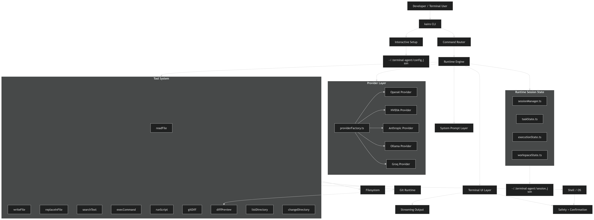

# KairoCLI

KairoCLI is a terminal-native AI coding assistant built with TypeScript and LangChain.

It is evolving toward a runtime-oriented coding agent architecture with:
- provider abstraction
- runtime session management
- workspace-aware execution
- tool orchestration
- git-aware workflows

---
# Demo

https://github.com/user-attachments/assets/e95504c1-01e1-4f7d-9eea-ad753c23acb2

---

# System Architecture



---

# Features

- Interactive terminal-native AI assistant
- Multi-provider runtime support
  - NVIDIA
  - OpenAI
  - Anthropic
  - Ollama
  - Groq
- Runtime session architecture
- Workspace + execution state tracking
- Streaming responses
- Tool-calling agent with safety checks
- Git-aware tooling
- Diff preview system
- File editing + shell execution
- Docker-compatible runtime
- Interactive setup flow
- Persistent runtime sessions

---

# Install

## From npm

```bash
npm install -g @abhilov/kairo
```

## From source

```bash
pnpm install
```

---

# Setup

```bash
kairo setup
```

This configures:
- provider
- model
- API keys
- optional base URL

Configuration is stored in:

```bash
~/.terminal-agent/config.json
```

---

# Run

Development:

```bash
pnpm dev
```

Production build:

```bash
pnpm build
pnpm start
```

Direct CLI from build output:

```bash
node dist/index.js
```

Global CLI:

```bash
kairo
```

---

# CLI Commands

| Command | Description |
|---|---|
| `kairo` | Start interactive assistant |
| `kairo setup` | Configure provider and model |
| `kairo doctor` | Run configuration health checks |
| `kairo help` | Show CLI help |
| `kairo version` | Show CLI version |

---

# Internal Commands

| Command | Description |
|---|---|
| `/help` | Show interactive help |
| `/tools` | Show available tools |
| `/clear` | Clear runtime session memory |
| `clear` / `cls` | Clear terminal screen |
| `exit` | Exit KairoCLI |

---

# Available Tools

- `get_time`
- `execute_command`
- `current_directory`
- `list_directory`
- `read_file`
- `search_text`
- `change_directory`
- `write_file`
- `replace_in_file`
- `run_script`
- `git_status`
- `git_diff`
- `diff_preview`

---

# Runtime Architecture

KairoCLI is shifting from:
- chatbot-style memory systems

toward:
- runtime session architecture
- execution state tracking
- workspace-aware orchestration
- coding-agent infrastructure

Current runtime state system includes:

```txt
runtime/
├── taskState.ts
├── executionState.ts
├── workspaceState.ts
└── sessionManager.ts
```

Runtime persistence:

```bash
~/.terminal-agent/session.json
```

---

# Docker

Build image:

```bash
docker build -t kairocli .
```

Run container:

```bash
docker run -it kairocli
```

---

# Tech Stack

- TypeScript
- Node.js
- LangChain
- Zod
- Docker
- pnpm

---

# Repository

GitHub Repository:

https://github.com/abhilov23/Terminal-Agent-AI

npm Package:

https://www.npmjs.com/package/@abhilov/kairo
